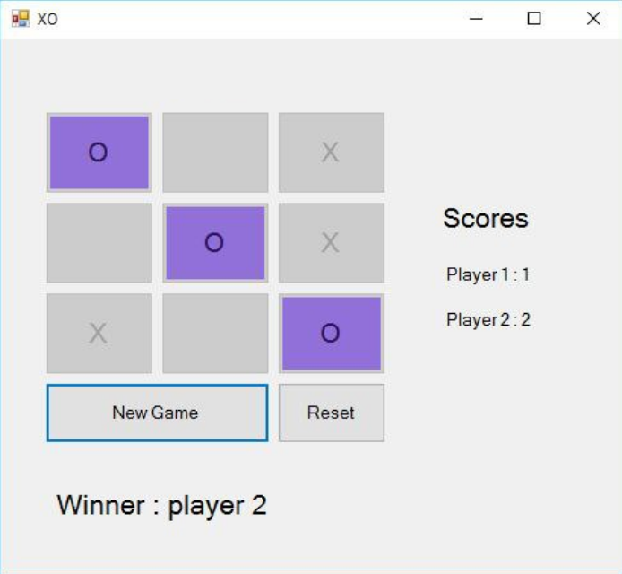

# XO-Game-with-LinkedList

My 2nd project was in the "Advance Programming" course at spring 2016 when I was in the 2nd semester of my bachelor's at IAUSTB. Tic-tac-toe, noughts and crosses, or Xs and Os is a paper-and-pencil game for two players who take turns marking the spaces in a three-by-three grid with X or O. The player who succeeds in placing three of their marks in a horizontal, vertical, or diagonal row is the winner. I implemented this game in two versions. One of them is implemented by Array and the other is by LinkedList.

|  | 
|:--:| 
| *Version One(LinkedList)* |

